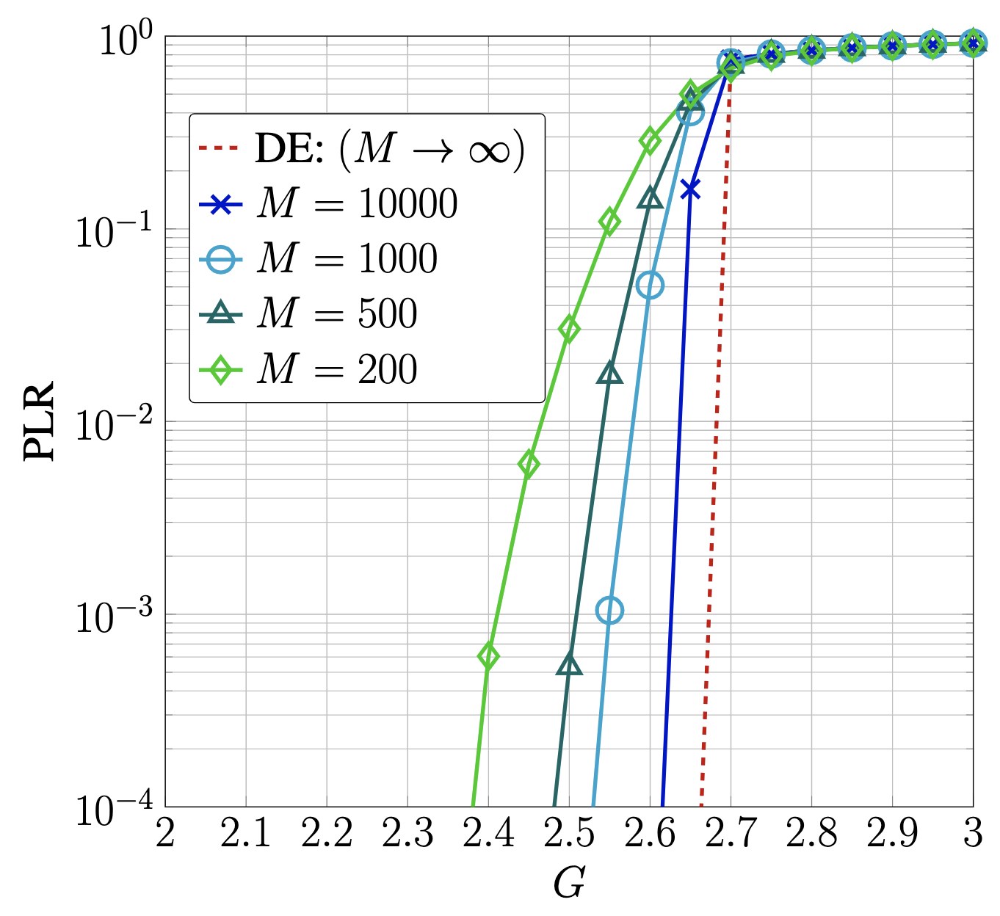

[](https://doi.org/10.1109/GCWKSHPS58843.2023.10464976) [](https://opensource.org/licenses/MIT)

## Abstract

This repository provides C++ implementations for C-SA (Coded Slotted ALOHA) system over Rayleigh fading channels.

### Overview of what is provided
- Monte Carlo Simulation
- Density Evolution

## Development environment
```
~ % xcodebuild -version
Xcode 15.3
Build version 15E204a
~ % c++ --version
Apple clang version 15.0.0 (clang-1500.3.9.4)
Target: x86_64-apple-darwin23.4.0
Thread model: posix
```

## Paramaters
The parameters in these source codes are as follows:

<ins>Simulation<ins>
- ite : # of fading samples
- SNR : average received SNR per device (dB)
- M : M+1 collisions wihtin a slot
- K : # of message segments
- trans : transmission packets per slot
  
<ins>Analysis<ins>
- SNR : average received SNR per device (dB)
- M : M+1 collisions wihtin a slot
- IS : # of message segments

Please, adjust the parameters as needed for your situation.

## Demo
<ins>Simulation<ins>

Here's how you'd run these codes:
```
g++ -o csa c-sa_simulation_main.cpp
./csa 10000 dist.txt
```
The first input is the number of slots, and the second input file is the degree distribution.

The execution result is as follows:
```
degree distribution of edge-perspective
0 0.654475
1 0.135331
2 0.031576
7 0.14847
8 0.0301481

degree distribution of node-perspective
1 0.867343
2 0.0896737
3 0.0139487
8 0.024595
9 0.00443931

G PLR Throughput
2 0.87893 0.24214
1.95 0.858964 0.27502
1.9 0.840547 0.30296
1.85 0.815203 0.341875
...
```

<ins>Analysis<ins>

First, you need to optimize the degree distribution, and the method for compiling it is as follows: using Differential Evolution.
```
g++ -o de Differential_Evolution.cpp
./de
initialize distribution
```


## Result



## How to cite

If you extend or use this work, please cite the [paper](https://ieeexplore.ieee.org/document/10464976) where it was introduced:
```
@INPROCEEDINGS{10464976,
  author={Takahashi, Yuhei and Masuo, Ippei and Song, Guanghui and Kimura, Tomotaka and Cheng, Jun},
  booktitle={2023 IEEE Globecom Workshops (GC Wkshps)}, 
  title={Coded Slotted ALOHA over Rayleigh Block Fading Channels: BP Threshold and Converse Bound}, 
  year={2023},
  volume={},
  number={},
  pages={1523-1528},
  keywords={Couplings;Codes;Protocols;Error probability;Rayleigh channels;Interference;Energy efficiency;belief propagation threshold;coded slotted ALOHA;converse bound;Rayleigh fading;spatial coupling},
  doi={10.1109/GCWkshps58843.2023.10464976}}
```
